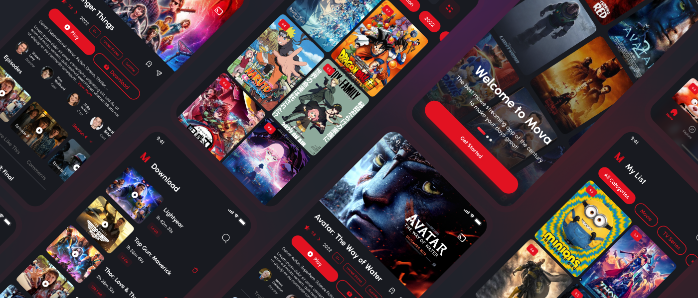

# Mobile Movie App

## Description
This is a mobile movie app that allows users to search for movies and view details about them. The app is built using React Native and the [MovieDB API](https://developers.themoviedb.org/).

### Assets
- [x] [MovieDB API](https://developers.themoviedb.org/3/getting-started/introduction)
- [x] [Font Roboto](https://fonts.google.com/specimen/Roboto)
- [x] [Assets Figma Mova](https://www.figma.com/file/6DH7RojuLYzvGjCYifCIzA/Mova---Movie-Streaming-App-UI-Kit-(Community)?node-id=0%3A1)
